# starfleet-reservation-system

### Projet final de Java : HEMELSDAEL Alexandre CMS B2

* **commande pour compiler toutes les classes en même temps** : se placer dans le dossier starfleet : `javac modele/mission/*.java modele/personne/*.java modele/reservation/*.java modele/vaisseau/*.java systeme/*.java ui/*.java Main.java`

* **commande pour lancer le main**  : se placer dans le dossier java : `java -cp . fr.starfleet.Main`

## Liste de fonctionnalités implémentées : 
* **Mission** : La classe Mission représente une mission spatiale avec des attributs tels que son code, sa description, ses dates, sa destination, le vaisseau assigné et les réservations des participants. Elle permet d’ajouter ou d’annuler des réservations tout en respectant une capacité maximale. Un système de gestion des missions pourrait être amélioré en vérifiant la disponibilité du vaisseau et en empêchant les dépassements de capacité. La méthode toString() offre une représentation lisible des missions pour faciliter leur affichage. Cette classe est essentielle pour organiser efficacement les voyages de la flotte Starfleet
* **Civi** : La classe Civil est une sous-classe de Personne qui représente un civil voyageant dans l’univers de Starfleet. Elle ajoute deux attributs spécifiques : la planète d’origine et le motif du voyage. Grâce à ses getters et setters, il est possible de récupérer ou modifier ces informations. La méthode getDescription() permet d’afficher un résumé du civil, incluant son nom, sa planète d’origine et la raison de son voyage. Cette classe permet de mieux gérer les passagers non militaires dans le système de réservation des missions spatiales
* **Officier** : La classe Officier est une extension de Personne, représentant un membre du personnel militaire de Starfleet. Elle introduit deux attributs spécifiques : le rang et la spécialité de l’officier. Ces informations sont accessibles et modifiables via des getters et setters dédiés. La méthode getDescription() fournit un résumé détaillé de l’officier, incluant son nom, son rang et sa spécialité. Cette classe permet de gérer efficacement les membres du personnel militaire dans le cadre des missions spatiales.
* **Personne** : La classe Personne est une classe abstraite qui sert de modèle pour les différentes catégories de personnes dans Starfleet. Elle définit trois attributs communs : le nom, le prénom et un identifiant unique. Ces attributs sont accessibles via des getters et modifiables avec des setters. La méthode toString() fournit une représentation textuelle de l'objet, tandis que la méthode abstraite getDescription() impose aux sous-classes (comme Civil et Officier) de définir leur propre description. Cette classe assure une structure commune et une gestion uniforme des individus au sein du système. 
* **Reservation** : La classe Reservation gère les réservations des personnes pour les missions. Elle contient des attributs essentiels tels que l'identifiant de la réservation, la personne concernée, la mission associée, la date de réservation et un statut de confirmation. Grâce aux méthodes de confirmation et d'annulation, elle permet de suivre et modifier l'état des réservations. Des getters et setters assurent la gestion et la modification des données. Cette classe joue un rôle clé dans l'organisation des missions en attribuant des places aux participants.
* **Vaisseau** : La classe Vaisseau représente un vaisseau spatial avec des attributs tels que le nom, l'immatriculation, la capacité maximale et la liste des missions assignées. Elle permet de gérer les caractéristiques du vaisseau grâce aux getters et setters. Une méthode ajouterMission facilite l'ajout de nouvelles missions à son historique. Ce modèle est essentiel pour suivre les missions et organiser le transport des équipages et passagers dans l'univers Starfleet.
* **SystemeReservation** : La classe SystemeReservation gère l'ensemble des réservations pour les missions spatiales. Elle permet d'ajouter, supprimer et rechercher des vaisseaux, des personnes, des missions et des réservations. Des méthodes facilitent la réservation d'une mission pour une personne, garantissant que seules les missions avec des places disponibles sont accessibles. Le système intègre aussi des fonctionnalités de sauvegarde et de chargement des données, ainsi que des affichages clairs pour visualiser les éléments en cours. Une gestion complète et efficace des vols interstellaires pour Starfleet !
* **InterfaceConsole** : La classe InterfaceConsole est conçue pour gérer un système de réservation de vaisseaux spatiaux via une interface en ligne de commande. Elle permet à l'utilisateur de gérer des entités telles que les vaisseaux, les personnes, les missions et les réservations. Grâce à un menu interactif, l'utilisateur peut ajouter, supprimer ou afficher ces éléments, et sauvegarder ou charger l'état du système. Le programme fonctionne en boucle, offrant plusieurs options jusqu'à ce que l'utilisateur choisisse de quitter. C'est un système simplifié mais fonctionnel pour la gestion des ressources dans un environnement spatial.

## Captures d'écran du projet : 
### Capture d'écran menu gestion de starfleet : 
* capture d'écran du menu de gestion de starfleet reservation : 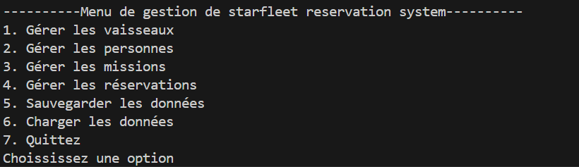
### Captures d'écrans de gestion des vaisseaux :
* capture d'écran de la gestion des vaisseaux : 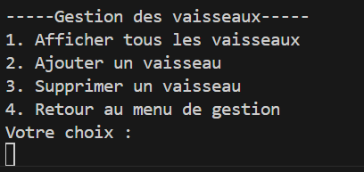
* capture d'écran : afficher tous les vaisseaux : 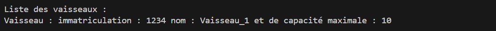
* capture d'écran d'ajouter un vaisseau : 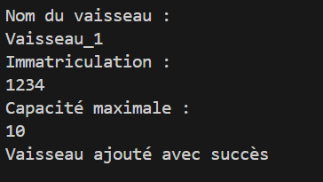
* capture d'écran de supprimer un vaisseau : 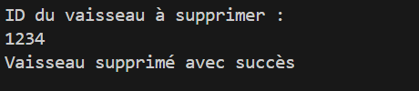
### Captures d'écran de la gestion des personnes : 
* capture d'écran pour afficher les personnes : 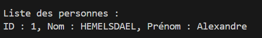
* capture d'écran pour ajouter une personne : 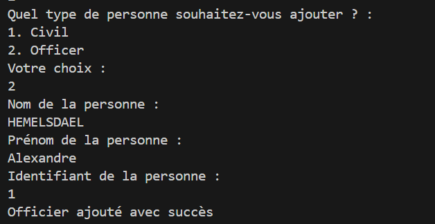
* capture d'écran pour supprimer une personne : 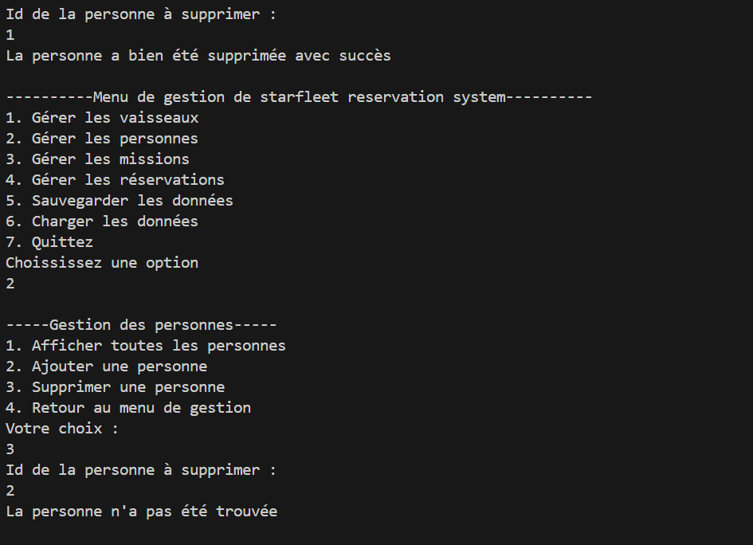
### Captures d'écran de la gestion des missions : 
* capture d'écran pour afficher les missions : 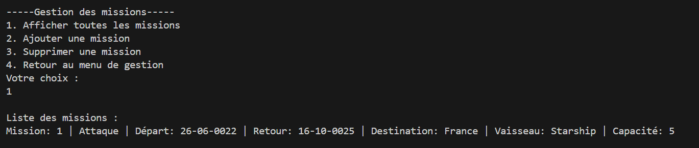
* capture d'écran pour ajouter une mission : 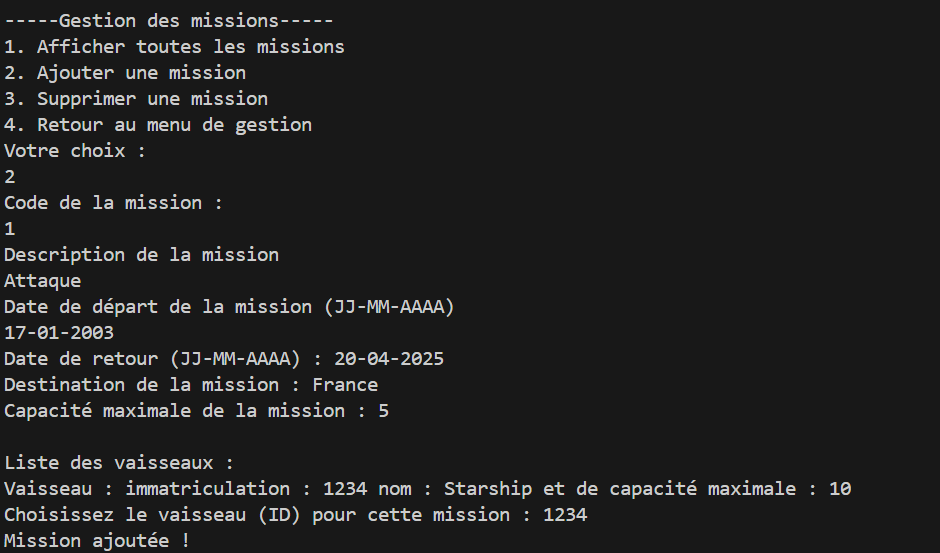
* capture d'écran pour supprimer une mission : 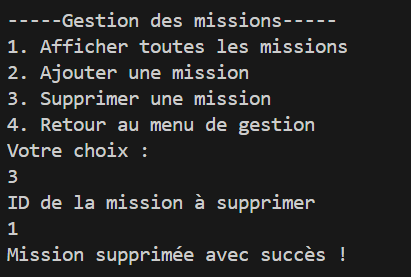
### Captures d'écran de la gestion des réservations : 
* capture d'écran pour afficher les réservations : 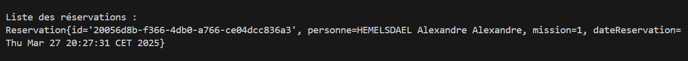
* capture d'écran pour ajouter une réservation : 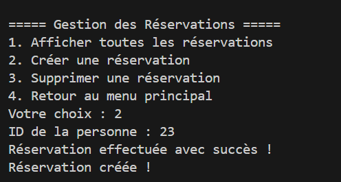
* capture d'écran pour supprimer une réservation : 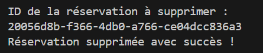

## Difficultés rencontrées : 
Problèmes liés à la configuration du classpath donc j'avais quelques erreurs liées à mes packages et mes imports. J'ai réussi à corriger ce problème en modifiant le classpath. 